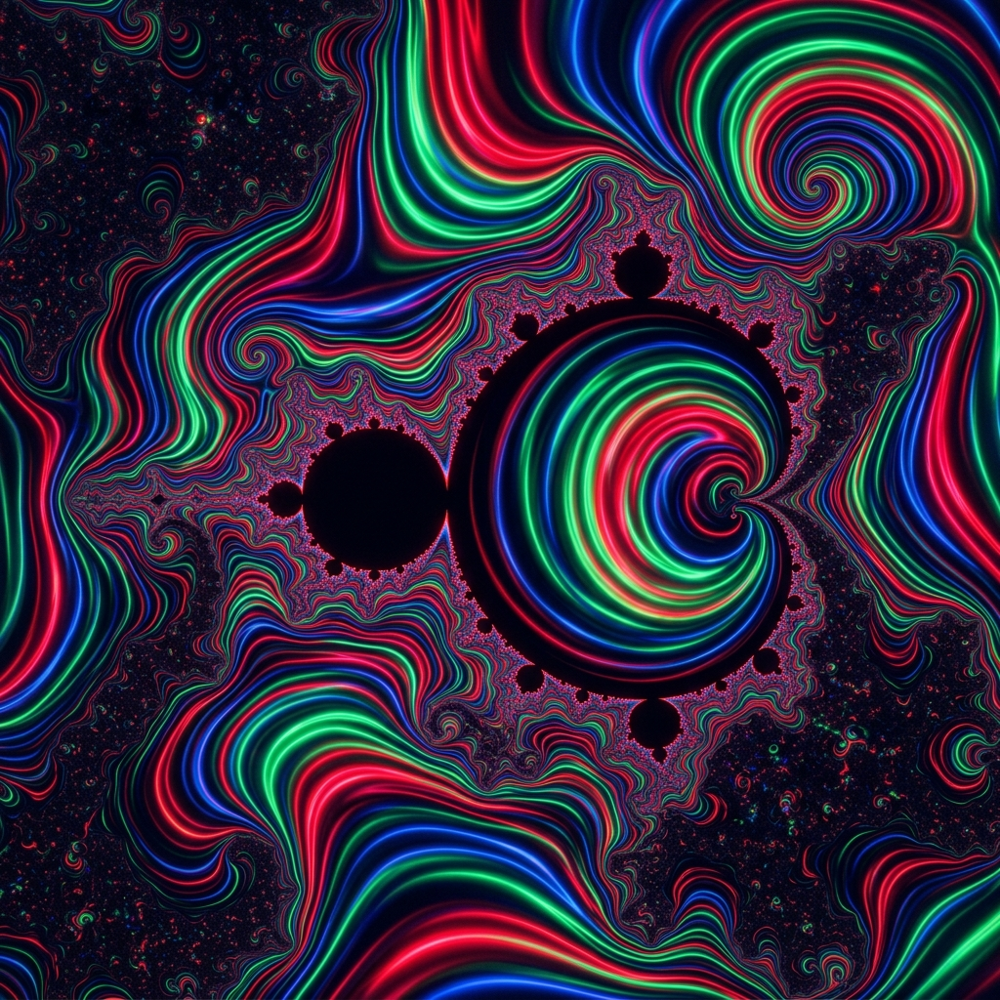

# Cinematic GPU Mandelbrot Explorer



A high-performance, GPU-accelerated Mandelbrot set explorer and cinematic animation written in Python.

This prototype uses **Vispy** and **OpenGL Fragment Shaders** to calculate and render the fractal directly on the GPU, allowing for buttery-smooth 60 FPS deep dives into the Mandelbrot set.

## Features
- **True GPU Acceleration**: Offloads all math to the GPU via OpenGL.
- **Cinematic Auto-Pilot**: Automatically dives into famously beautiful areas (Seahorse Valley, Elephant Valley, Mini Mandelbrot) and loops beautifully.
- **Flowing Psychedelic Colors**: Uses continuous iteration formulas mapped to sine waves to create perfectly smooth, flowing color bands.
- **Dynamic Detail**: Automatically increases calculation depth (max iterations) as you zoom deeper to preserve crisp details.

## Prerequisites

- Python 3.8+
- An OpenGL-capable GPU (Integrated or Dedicated)

## Installation and Running Locally

1. **Clone the repository**:
   ```bash
   git clone https://github.com/opensai/mandelbrot-gpu-dive.git
   cd mandelbrot-gpu-dive
   ```

2. **Create a virtual environment (Recommended)**:
   ```bash
   python3 -m venv .venv
   source .venv/bin/activate  # On Windows use: .venv\Scripts\activate
   ```

3. **Install the dependencies**:
   ```bash
   pip install -r requirements.txt
   ```

4. **Run the application**:
   ```bash
   python mandelbrot.py
   ```

Enjoy the dive!
